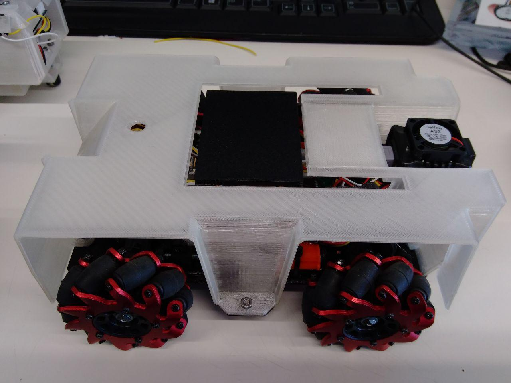
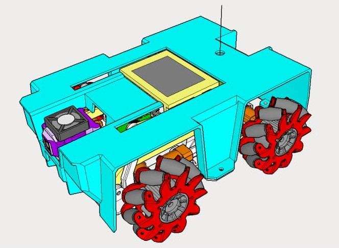
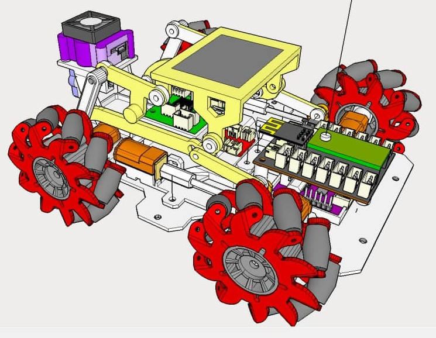
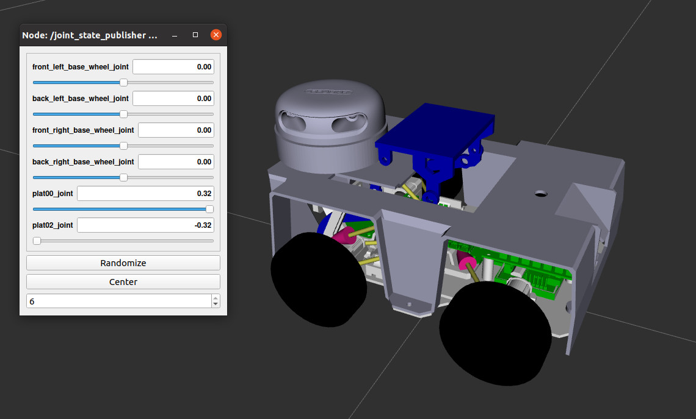

# rostanke
Rostanke: pallet transport robot emulation with omnidirectional wheel

This repository hosts the source code for the ROS <ROSTANKE > package.

 

This is part of the practices that I am doing in the course MAstering Robot orerating System ROS in the ROBOCADEMY

## Description ##

The robot type is a four omnidirectional wheel with platfrom to carry pallets. 

- Teensy 4.0 .
- wifi with ESP8266.
- Bluetooh.
-  4 Motors [Micro Metal Gear Motor with Connector ](https://www.dfrobot.com/product-1410.html).
- 3.7v Lipo battery of 6000 mah, with a Powerboost that provides us with 5 v.
- Induction charging system.
- camera Jevois
- Laser sensor [vl6180](https://www.mouser.es/datasheet/2/737/adafruit-vl6180x-time-of-flight-micro-lidar-distan-1396510.pdf)
- You can add sensors or actuators, giving it great versatility.
- Optionally you can add a raspberry pi 3 or 4 with camera.
- i add a laser sensor in simulation

## Key concepts covered ##
- The goal of this app is to practice with urdf and xacro, and implement it in gazebo to simulate.

- Create a model base in the stl.

- Create a xacro:macro

- Add a platform in the xacro

## Update ##

- rostanke_description 

- rostanke_gazebo

- rostanke_control

- pictures 

[Frist test moviments](https://www.youtube.com/watch?v=yKEk6LIcVnI)

## Usage ## 

To use the `rostanke` package clone this repository into the `src` folder of your catkin workspace.

Then build the workspace with `catkin_make`.

   roslaunch rostanke_description view_rostanke.launch 

   roslaunch rostanke_gazebo tanke_view.launch   

   roslaunch rostanke_control roseco_control2.launch 
   
   
## Problems ##

I'm using a colleague's project as a guide [Hello_robot](https://github.com/mukmalone/hello_robot). But I can't get the robot to move in the gazebo. The platfrom is working.

## Next Step ##

- Navigation

- Develop Control plugin

- Decelop Driver to simulation and real Robot

 
